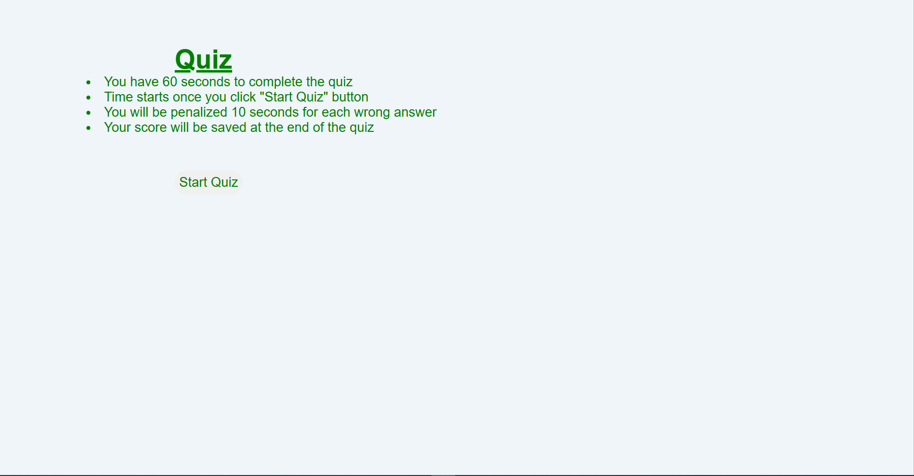
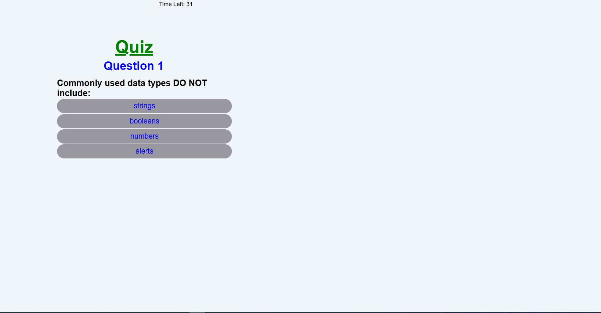
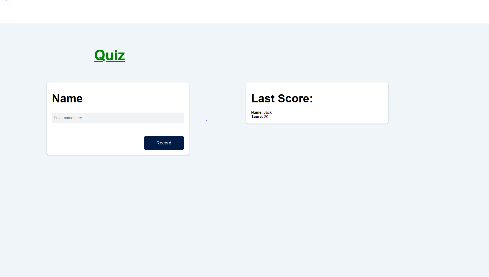

# Quizz
This project presents ten questions to test participants on Javascript concepts
# 04 Web APIs: Code Quiz


## User Story

```
AS A coding boot camp student
I WANT to take a timed quiz on JavaScript fundamentals that stores high scores
SO THAT I can gauge my progress compared to my peers
```

## Acceptance Criteria

```
GIVEN I am taking a code quiz
WHEN I click the start button
THEN a timer starts and I am presented with a question
WHEN I answer a question
THEN I am presented with another question
WHEN I answer a question incorrectly
THEN 10 seconds are is subtracted from the clock
WHEN all questions are answered or the timer reaches 0
THEN the quiz is over
WHEN the quiz is over
THEN I can save my initials and my score
```

## Mock-Up


The following animation demonstrates the application functionality:






## Review


https://kawam001.github.io/Quiz/

https://github.com/kawam001/Quiz


